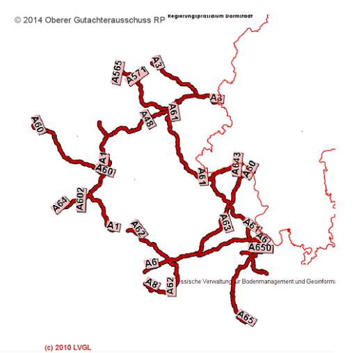
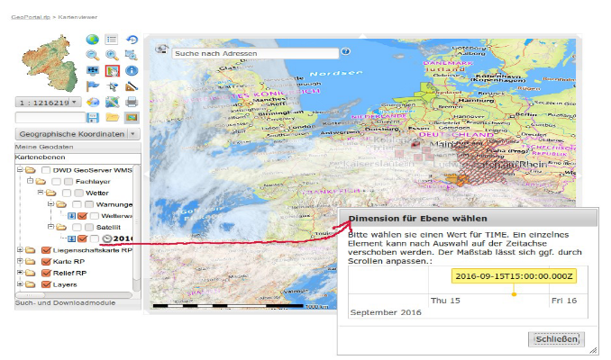

ifdef::env-github[]
:important-caption: 📕
:tip-caption: 📒
:note-caption: 📘
endif::[]

ifndef::env-github[]
:important-caption: :exclamation:
:note-caption: :paperclip:
:tip-caption: :bulb:
endif::[]

:icons: font

:toc: macro
:toc-title:
:toclevels: 4
:sectnumlevels: 4

*Geodateninfrastruktur Deutschland*

[discrete]
= Architektur der Geodateninfrastruktur Deutschland - Vorgaben der GDI-DE zur Bereitstellung von Darstellungsdiensten

[width="100%",cols="24%,76%",]
|===
|*Bezeichnung* |Architektur der Geodateninfrastruktur Deutschland – Vorgaben der GDI-DE zur Bereitstellung von Darstellungsdiensten
|*Autor* |Arbeitskreis Geodienste
|*Erstellt am* |28.01.2019
|*Bearbeitungszustand* |vorgelegt
|*Version* |1.0.1
|*Dokumentenablage* |lokal
|===

== Inhaltsverzeichnis
toc::[]

<<<

:sectnums:

== Einleitung
Die Geodateninfrastruktur in Deutschland (GDI-DE) hat das Ziel, Geodaten und Geodatendienste von Bund, Ländern und Kommunen für Wirtschaft, 
Wissenschaft, Verwaltung und Bürger interoperabel und zukunftsfähig bereitzustellen. Die Verwendung von offenen Standards und genormten 
Schnittstellen ist eine Grundvoraussetzung für die Integration von Geodateninfrastrukturen in E-Governmentprozesse. +
Innerhalb der GDI-DE erfolgt der standardisierte Zugriff auf grafische Präsentationen von verteilten Geodaten über Darstellungsdienste, welche sich direkt in Geschäftsprozesse und Applikationen integrieren lassen. +
Die Architektur der GDI-DE sieht hierfür grundsätzlich eine dezentrale Bereitstellung von Geodaten mittels standardisierter Webservices vor (https://de.wikipedia.org/wiki/Serviceorientierte_Architektur[SOA Prinzip] footnote:[Architektur der GDI-DE - Technik:  https://www.geoportal.de/DE/GDI-DE/Arbeitskreise/Architektur/architektur.html?lang=de]). Die verwendeten Dienste basieren auf internationalen Standards und Normen, welche aufgrund ihrer weltweiten Verbreitung einen großen Anwendungsspielraum zulassen.

== Anwendungsbereich
Das vorliegende Dokument beinhaltet Anforderungen und Empfehlungen, die für eine interoperable Bereitstellung von Darstellungsdiensten innerhalb Deutschlands notwendig sind bzw. eine solche verbessern. +
Dabei wird eine größtmögliche Interoperabilität mit der Europäischen Geodateninfrastruktur INSPIRE (http://inspire.ec.europa.eu[Infrastructure for Spatial Information in the European Community]) Viele der hier definierten Vorgaben basieren auf den im Rahmen der Umsetzung von INSPIRE gesammelten Erfahrungen der vergangenen Jahre. +
Um eine nahtlose Integration von INSPIRE und GDI-DE zu gewährleisten, gelten die hier aufgeführten Anforderungen und Empfehlungen auch für die INSPIRE-Darstellungsdienste. 

Die Anforderungen und Empfehlungen bauen auf den internationalen Standards und Normen des W3C, des OGC sowie den ISO-Normen auf. Anforderungen aus diesen Standards/Normen, die für alle Darstellungsdienste ohnehin verpflichtend sind, werden im vorliegenden Dokument nicht wiederholt aufgeführt. Für Darstellungsdienste, die unter die INSPIRE-Richtlinie fallen, ergeben sich i. d. R. zusätzliche Anforderungen aus INSPIRE-Durchführungsbestimmungen, die ebenfalls nicht Bestandteil des vorliegenden Dokumentes sind. 

Das bisher in der GDI-DE gültige WMS-DE Applikationsprofil vom 17.10.2006 [*GDI-DE WMS Profil V1.0*] wird durch dieses Dokument ersetzt

== Hinweise zum Dokument
Das vorliegende Dokument ist in ein Kapitel zu Anforderungen an die Bereitstellung von Darstellungsdiensten (vgl. Kapitel 4) und ein Kapitel mit Erläuterungen und Hintergrundinformationen (Kapitel 5) untergliedert. Diese Aufteilung dient dazu, einerseits einen prägnanten Überblick über Implementierungsanforderungen zu wahren und andererseits Hintergrundinformationen und Begründungen für Interessierte vorzuhalten. Hierdurch entfällt zudem der Bedarf für eine Auflistung durchlaufend nummerierter Vorgaben. +
Bei der Fortschreibung wird das Anforderungskapitel (vgl. Kapitel 4) auch um Verweise auf zugehörige Testfallbeschreibungen in Form von Abstract Test Suites (ATS) ergänzt. ATS dienen als Grundlage für die Entwicklung automatisierter Überprüfungen von Vorgaben aus diesem Dokument. +
Für eine bessere Lesbarkeit werden Quellenangaben *fett*, Eigennamen und Operatoren _kursiv_ und Bezeichnungen von XML-Elementen, -Attributwerten und Codes über eine ``eigene Schriftart`` hervorgehoben.

== Anforderungen
=== Allgemein
==== Art der Bereitstellung
Um ein höchstes Maß an Interoperabilität und Flexibilität zu erreichen, sollen Geodaten grundsätzlich über OGC WMS-Schnittstellen (WMS) bereitgestellt werden. +
Das Anbieten einer OGC WMTS-Schnittstelle (WMTS) ist möglich, aber nicht verpflichtend. Über WMS und WMTS hinaus können beliebige weitere Schnittstellen angeboten werden.

[IMPORTANT]
====
*Anforderung 1*

Wird ein Datensatz über einen Darstellungsdienst angeboten, so muss dieser mindestens über eine OGC WMS-Schnittstelle verfügen.
====

Es gibt zwei häufig verwendete Versionen des WMS-Standards mit unterschiedlichem Verbreitungsgrad: WMS-Version 1.1.1 und WMS Version 1.3.0. Aktuell unterstützen die meisten Server die neuere WMS-Version 1.3.0 [*OGC WMS 1.3.0*]. Die Entwicklung der Clients verläuft jedoch asynchron: Viele Clients haben Probleme beide Versionen des WMS-Standards parallel zu verwenden. Das liegt insbesondere an der unterschiedlichen Interpretation der Reihenfolge der Koordinatenachsen beim Aufruf der Operationen3, weshalb auch mittelfristig empfohlen wird, beide Versionen parallel anzubieten. 

[TIP]
====
*Empfehlung 1*

Die WMS-Schnittstelle eines Darstellungsdienstes sollte sowohl die Version 1.1.1 als auch die Version 1.3.0 dieses Standards unterstützen.
====

[IMPORTANT]
====
*Anforderung 2*

Kann nur eine Version des WMS Standards angeboten werden, so ist die aktuellere Version 1.3.0 zu verwenden.
====

[IMPORTANT]
====
*Anforderung 3* 

Ein Kartenserver, der eine WMTS-Schnittstelle bereitstellt, muss die Version 1.0.0 dieses Standards unterstützen.
====

==== Persistenz / Identität
Bei einer SOA (_Service Oriented Architecture_) ist es systemrelevant, dass die Datenquellen dauerhaft referenzierbar sind. Im Falle von Darstellungsdiensten auf Basis von WMS und WMTS gibt es für jeden _Service_ eine URL, über die weitere Informationen zum Dienst in Form von _Capabilities_-Dokumenten verfügbar gemacht werden. Diese _Capabilities_-Dokumente beinhalten zum einen die Zugriffsadressen (URLs) zu den jeweiligen technischen Operationen (_GetMap_, _GetFeatureInfo_, etc.), zum anderen enthalten sie Metadaten über den Inhalt, welcher über den Dienst publiziert wird (_Layerstruktur_, _Layer_, etc.). +
Darstellungsdienste können über die URL zum _Capabilities_-Dokument in Geschäftsprozesse und Applikationen eingebunden werden. Die Anwendung kommuniziert selbständig über das Netzwerk mit der jeweiligen Datenquelle und erhält als Antwort die benötigten Informationen bzw. Kartenbilder. +
Die eindeutige Referenzierung des ``Contents`` (_Layers_) erfolgt dabei durch eine Kombination der URL des Servers mit dem ``<Name>`` bzw. ``<ows:Identifier>`` Element des jeweiligen Layers. Dienst-URL und <Name> bzw. <ows:Identifier> von Layern sollen nach Veröffentlichung eines Dienstes nicht mehr verändert werden. Die Änderung des Wertes hätte zur Folge, dass alle abhängigen Prozesse und Applikationen angepasst werden müssten. Für den Betrieb und die Funktionsfähigkeit einer Geodateninfrastruktur (GDI) ist die Persistenz dieser Identifikatoren von hoher Bedeutung. +
Um die Nutzer in die Lage zu versetzen, sich über Änderungen von verteilten Diensten zu informieren, sehen die zugrundeliegenden Spezifikationen den optionalen Parameter ``UPDATESEQUENCE`` bei einem _GetCapabilities Request_ vor, dessen Unterstützung aus dem o. g. Grund empfohlen wird. 

[TIP]
====
*Empfehlung 2*

Der ``UPDATESEQUENCE`` Parameter der _GetCapabilities_ Operation sollte unterstützt werden.
====

[TIP]
====
*Empfehlung 3* 

Der Wert des ``UPDATESEQUENCE`` Parameters sollte als ``String`` in Form eines ISO 8601:2004 Zeitstempels – CCYY-MM-DDThh:mm:ss.sssZ - implementiert werden.
====

==== Layer Name / Identifier
Das _Layer_ ``<Name>`` Element beim WMS, beziehungsweise das ``<ows:Identifier>`` Element beim WMTS sind Identifikatoren, die grundsätzlich von Software genutzt werden (Maschine-Maschine-Kommunikation). Um Fehler beim Auslesen eines _Capabilities_-Dokumentes auszuschließen, sollten sich diese Identifikatoren nur aus Zeichen zusammensetzen, deren Verwendung in unterschiedlichen Programmiersprachen unbedenklich ist. Außerdem sollte die Zahl der verwendeten Zeichen nicht zu groß sein, da es sonst bei _Clients_, die Kartenanfragen nur über _HTTP GET_ umsetzen, zu Fehlern bei der Übertragung der Anfragen kommen kann footnote:[Die maximale Länge einer URL ist abhängig vom verwendeten Browser und vom Betriebssystem.].

Innerhalb eines Dienstes darf der gleiche _Layer_-Identifikator nicht mehrfach vorkommen, da dieser ansonsten vom _Client_ nicht mehr unterschieden werden kann.

[IMPORTANT]
====
*Anforderung 4* 

Layernamen bzw. -identifikatoren müssen innerhalb eines Dienstes eindeutig sein und folgendem regulären Ausdruck entsprechen: [0-9a-zA-Z\.\-_:
+]
====

[TIP]
====
*Empfehlung 4*

Die Länge der Zeichenkette des Layernamen bzw. -identifikators sollte so kurz wie möglich sein.
====

==== Verfügbarkeit 
Im Rahmen der Umsetzung der INSPIRE-Richtlinie wurde eine Rechtsverordnung [*INS VO Netzdienste*] erlassen, die eine Verfügbarkeit von 99%5 für die Netzdienste der europäischen Geodateninfrastruktur vorgibt. Erst mit einer hohen Verfügbarkeit können die Ziele einer GDI erreicht werden. Die Nutzer sollen direkt über das Internet auf die verteilten Geodaten zugreifen, womit die Notwendigkeit des Vorhaltens von Sekundärdaten (offline) in den meisten Fällen entfallen kann. Die für INSPIRE geltende Anforderung wird für die GDI-DE als Empfehlung übernommen.

[TIP]
====
*Empfehlung 5*

Die Dienste sollten eine Verfügbarkeit von mindestens 99% gewährleisten.
====

==== Sprache
Die Inhalte von Textfeldern in der Antwort auf die _GetCapabilities_-Anfrage werden grundsätzlich in deutscher Sprache veröffentlicht. Sollen weitere Sprachen bereitgestellt werden, ist der von INSPIRE vorgesehene, zusätzliche Language Parameter zu nutzen.

[IMPORTANT]
====
*Anforderung 5* 

Die Informationen in den Textfeldern der _Capabilities_-Dokumente sind in deutscher Sprache zu verfassen. Werden weitere Sprachen angeboten, so erfolgt dies analog zu den Handlungsempfehlungen für INSPIRE-Darstellungsdienste [*GDI-DE HE INS Darstellungsdienste*].
====

==== Zeichenkodierung von textbasierten Rückgabewerten

[IMPORTANT]
====
*Anforderung 6*
Textbasierte Rückgabewerte, wie zum Beispiel Antworten auf _GetCapabilities_ und _GetFeatureInfo_-Anfragen sowie Service Exceptions, müssen UTF-8 kodiert sein.
====

=== Metadaten (in Capabilities und ISO Dokumenten)
Bei den Metadaten des Dienstes (_Capabilities_-Dokument) wird zwischen _Service Level_ und _Content Level_ unterschieden. Die _Service Level_ Informationen beziehen sich auf Informationen zum Dienst und zum Dienstanbieter, die _Content Level_ Informationen beschreiben die bereitgestellten Layer.

Zusätzlich zu den Metadaten in den _Capabilities_-Dokumenten des Dienstes ist ein ISO 19139 Dokument zu erstellen und im Internet zu publizieren. Das Mapping zwischen den Elementen des _Capabilities_-Dokumentes und des ISO-Dokumentes wird im Folgenden dargelegt.

==== Service Level Metadaten
Die Metadaten im _Service Level_ der _Capabilities_ beschreiben den kompletten Dienst, nicht die Datenquellen des Dienstes. Die folgende Tabelle stellt die Metadaten der jeweiligen Schnittstellen in ihren Versionen gegenüber.

[IMPORTANT]
====
*Anforderung 7*
Für die bereitzustellenden _Service_-Metadatenelemente (in _Capabilities_- und ISO-Dokumenten) gilt die nachfolgende Tabelle.
====

``Grau hinterlegt`` Felder sind verpflichtend, normal formatierte Felder sind optional. ``Grau hinterlegte`` Felder, deren Bezeichner *fett* und unterstrichen dargestellt sind, beinhalten bedingt vorzuhaltende Informationen („wenn anwendbar bzw. vorhanden“).

.Service Level Metadaten
[stripes=none,cols="<,<,<,<,<",width="100%"]
|===
|WMS 1.1.1 |WMS 1.3.0 |WMTS 1.0.0 |Erläuterung | ISO19139 XPATH

|Name |Name |- |Technischer Name des Dienstes | 
|``Title`` |``Title`` |``Ows:Title`` |Titel des Dienstes | / gmd:MD_Metadata/gmd:identificationInfo/srv:SV_ServiceIdentificatio n/gmd:citation/gmd:CI_Citation/gmd:title/gco:CharacterString
|``Abstract`` |``Abstract`` |``Ows:Abstract`` |Beschreibung des Dienstes | / gmd:MD_Metadata/gmd:identificationInfo/srv:SV_ServiceIdentification/gmd:abstract/gco:CharacterString 
|KeywordList |KeywordList |Ows:Keywords |Liste der Schlüsselwörter | / gmd:MD_Metadata/gmd:identificatio nInfo/srv:SV_ServiceIdentification/gmd:descriptiveKeywords/gmd:MD_ Keywords/keyword/gco:CharacterString
|OnlineResource |OnlineResource |Ows:ProviderSite |Link zur Webseite des Diensteanbieters | / gmd:MD_Metadata/gmd:identificationInfo/srv:SV_ServiceIdentification/gmd:pointOfContact/gmd:CI_ResponsibleParty/gmd:contactInfo/gmd:CI_Contact/gmd:onlineResource/gmd:CI_OnlineResource/gmd:linkage/gmd:URL
|ContactPerson |ContactPerson |Ows:IndividualName |Kontaktperson | / gmd:MD_Metadata/gmd:identificationInfo/srv:SV_ServiceIdentification/gmd:pointOfContact/gmd:CI_ResponsibleParty/gmd:individualName/gco:CharacterString
|ContactPosition |ContactPosition |- |Position der Kontaktperson | / gmd:MD_Metadata/gmd:contact/gmd:CI_ResponsibleParty/gmd:positionName/gco:CharacterString
|``ContactOrganization`` |``ContactOrganization`` |``Ows:ProviderName`` |Kontaktorganisation | / gmd:MD_Metadata/gmd:identificationInfo/srv:SV_ServiceIdentification/gmd:pointOfContact/gmd:CI_Respo nsibleParty/gmd:organisationName/gco:CharacterString
|AddressType |AddressType |- |Art der Kontaktadresse | 
|Address |Address |Ows:DeliveryPoint |Straße und Hausnummer | / gmd:MD_Metadata/gmd:identificatio nInfo/srv:SV_ServiceIdentificatio n/gmd:pointOfContact/gmd:CI_Respo nsibleParty/gmd:contactInfo/gmd:C I_Contact/gmd:address/gmd:CI_Address/gmd:deliveryPoint/gco:CharacterString
|``City`` |``City`` |``Ows:City`` |Ort | / gmd:MD_Metadata/gmd:identificationInfo/srv:SV_ServiceIdentification/gmd:pointOfContact/gmd:CI_ResponsibleParty/gmd:contactInfo/gmd:CI_Contact/gmd:address/gmd:CI_Address/gmd:city/gco:CharacterString
|StateOrProvince |StateOrProvince |Ows:Administrat IveArea |Bundesland der postalischen Kontaktadresse. Angaben erfolgen per ISO3166-2Code (Bsp.: "DE-RP") zur Unterstützung automatischer Auswertungen | / gmd:MD_Metadata/gmd:identificationInfo/srv:SV_ServiceIdentification/gmd:pointOfContact/gmd:CI_ResponsibleParty/gmd:contactInfo/gmd:CI_Contact/gmd:address/gmd:CI_Address/gmd:administrativeArea/gco:CharacterString
|``PostCode`` |``PostCode`` |``Ows:PostalCode`` |Postleitzahl  | / gmd:MD_Metadata/gmd:identificationInfo/srv:SV_ServiceIdentification/gmd:pointOfContact/gmd:CI_ResponsibleParty/gmd:contactInfo/gmd:CI_Contact/gmd:address/gmd:CI_Address/gmd:postalCode/gco:CharacterString
|``Country`` |``Country`` |``Ows:Country`` |Angaben erfolgen per ISO3166-1 Code („DE“) | / gmd:MD_Metadata/gmd:identificatio
nInfo/srv:SV_ServiceIdentification/gmd:pointOfContact/gmd:CI_ResponsibleParty/gmd:contactInfo/gmd:CI_Contact/gmd:address/gmd:CI_Address/gmd:country/gco:CharacterString
|ContactVoiceTelephone |ContactVoiceTelephone |Ows:Voice |Telefonnummer der Kontaktorganisation | / gmd:MD_Metadata/gmd:identificationInfo/srv:SV_ServiceIdentification/gmd:pointOfContact/gmd:CI_ResponsibleParty/gmd:contactInfo/gmd:CI_Contact/gmd:phone/gmd:CI_Telephone/gmd:voice/gco:CharacterString
|``ContactElectronicEmailAddress`` |``ContactElectronicEmailAddress`` |``Ows:ElectronicMAilAddress`` |E-Mailadresse der Kontaktorganisation | / gmd:MD_Metadata/gmd:identificationInfo/srv:SV_ServiceIdentification/gmd:pointOfContact/gmd:CI_ResponsibleParty/gmd:contactInfo/gmd:CI_Contact/gmd:address/gmd:CI_Address/gmd:electronicMailAddress/gco
:CharacterString
|``Fees`` |``Fees`` |``Ows:Fees`` |Angaben zu Nutzungseinschränkungen und Nutzungsbedingungen (Kosten, Gebühren, Lizenzen, Quellenangabe, etc.) | / gmd:MD_Metadata/gmd:identificationInfo//gmd:resourceConstraints/gmd:MD_LegalConstraints[gmd:useConstraints/gmd:MD_RestrictionCode/@codeListValue="otherRestrictions"]
/gmd:otherConstraints/gmx:Anchor/text()
|``AccessConstraints`` |``AccessConstraints`` |``Ows:AccessConstraints`` |Angaben zu Einschränkungen des öffentlichen Zugangs | / gmd:MD_Metadata/gmd:identificationInfo//gmd:resourceConstraints/gmd:MD_LegalConstraints[gmd:accessConstraints/gmd:MD_RestrictionCode/@codeListValue="otherRestrictions"]/gmd:otherConstraints/gmx:Anchor/text()
|- |``*_MaxWidth_*`` |- |Maximale Breite des zurückgelieferten Bildes | 
|- |``*_MaxHeight_*`` |- |Maximale Höhe des zurückgelieferten Bildes | 
|===

===== Angaben zum Zugang und zur Nutzung von Diensten

[IMPORTANT]
====
*Anforderung 8*

Die Angaben des ``Fees``-Elementes aus dem _Capabilities_-Dokument müssen den Angaben des ``gmd:otherConstraints/gmx:Anchor``-Elementes entsprechen, welches sich auf das Element gmd:useConstraints des Dienst-Metadatensatzes bezieht. Sind mehrere Freitextelemente vorhanden, so sind diese mit „||„ zu verknüpfen.
====

[IMPORTANT]
====
*Anforderung 9*

Die Angaben des ``AccessConstraints``-Elementes aus dem Capabilities-Dokument müssen den Angaben des ``gmd:otherConstraints/gmx:Anchor``-Elementes entsprechen, welches sich auf das Element ``gmd:accessConstraints`` des Dienst-Metadatensatzes bezieht. Sind mehrere Freitextelemente vorhanden, so sind diese mit „||„ zu verknüpfen.
====

Für genauere Vorgaben zum Mapping der Elemente wird auf die Festlegungen zur Angabe von Nutzungsbedingungen im Metadaten-Konventionendokument verwiesen [*GDI-DE Konventionen MD*].

===== Verlinkung des Dienst-Metadatensatzes im Capabilities-Dokument

[IMPORTANT]
====
*Anforderung 10* 

Im _Capabilities_-Dokument ist ein Dienst-Metadatensatz zu verlinken. Die Verlinkung hat entsprechend der INSPIRE Vorgaben zu erfolgen (siehe [*GDI-DE HE INS Darstellungsdienste*]).
====

==== Content Level Metadaten im Capabilities-Dokument

[IMPORTANT]
====
*Anforderung 11* 

Für die bereitzustellenden _Content (Layer)_-Metadatenelemente in den _Capabilities_-Dokumenten gilt nachfolgende Tabelle.
====

``Grau hinterlegt`` Felder sind verpflichtend, normal formatierte Felder sind optional. ``Grau hinterlegte`` Felder, deren Bezeichner *fett* und unterstrichen dargestellt sind, beinhalten bedingt vorzuhaltende Informationen („wenn anwendbar bzw. vorhanden“).

.Content Level Metadaten
[cols="<,<,<,<",width="100%"]
|===
|WMS 1.1.1 |WMS 1.3.0 |WMTS 1.0.0 |Erläuterung

|``Title`` |``Title`` |``ows:Title`` |Titel des Layers
|``Name`` |``Name`` |``ows:Identifier`` |Technischer Name des Layers
|``Abstract`` |``Abstract`` |``ows:Abstract`` |Beschreibung des Layers
|KeywordList |KeywordList |ows:Keywords |Liste der Schlüsselwörter
|``BoundingBox`` |``BoundingBox`` |``ows:BoundingBox`` |Räumliche Ausdehnung des Layers (minimales Rechteck im Koordinatenreferenzsystem des Layers)
|``SRS`` |``CRS`` |``SupportedCRS`` |Liste der unterstützten Koordinatenreferenzsysteme
|``*_Dimension_*`` |``*_Dimension_*`` |``*_Dimensions_*`` |Angabe einer zusätzlichen Dimension
|AuthorityURL |AuthorityURL | |Referenzierung via URL auf die Geodaten haltende Stelle
|Identifier |Identifier | |Angabe des Resourcenidentifikators (gemäß ISO19128 CI_Citation.identifier)
|``*_MetadataURL_*`` |``*_MetadataURL_*`` |``*_ows:Metadata_*`` |Link zu einem ISO19139 kodierten Metadatensatz der Datengrundlage dieses Layers. (Hinweis: Die genaue Umsetzung der Daten-Dienste- Kopplung wird in einem eigenen Abschnitt erläutert.)
|Style |Style |Style |Angabe zu Darstellungsvorschriften und zur Legendendarstellung
|``*_ScaleHint_*`` |``*_MinScaleDenominator / MaxScaleDenominator_*`` | |Wert für die Berechnung bzw. Angabe des Minimalen und Maximalen Maßstabs des Layers footnote:[Hinweise zur Berechnung finden sich im Kapitel 7.2.4.6.9 von [*OGC WMS 1.3.0*\].]
|===

Die Maßstabsangaben können von den _Clients_ u. a. dazu genutzt werden, die Sichtbarkeit einzelner Legenden zu steuern. Sie werden in den Elementen ``<ScaleHint>`` bzw. ``<MinScaleDenominator>`` und ``<MaxScaleDenominator>`` angegeben. Um eine Vergleichbarkeit zu gewährleisten, muss von einer vereinbarten Bildschirmauflösung ausgegangen werden.

[TIP]
====
*Empfehlung 6* 

Die Berechnung der Maßstabszahlen sollte auf Basis einer Bildschirmauflösung von 90,714 dpi erfolgen.
====

[IMPORTANT]
====
*Anforderung 12* 

Werden die angegebenen Maßstabsbereiche unter- bzw. überschritten, liefert der Dienst für die jeweiligen _Layer_ transparente Bilder, sofern das angefragte Format Transparenz unterstützt. Kann kein transparentes Bild geliefert werden, so soll ein weißes Bild ausgeliefert werden. (Hexwert: 0xFFFFFF)
====

Die räumliche Ausdehnung der Daten, die über einen Layer bereitgestellt werden, wird über die Angabe eines ``<BoundingBox>`` Elementes je unterstützten CRS definiert.

[IMPORTANT]
====
*Anforderung 13* 

Die angegebene ``<BoundingBox>`` muss der minimalen umfassenden Begrenzung der bereitgestellten Daten entsprechen.
====

[TIP]
====
*Empfehlung 7* 

Sollen _Keywords_ dazu verwendet werden, _Layer_ thematisch zu klassifizieren, so sollte dies in der WMS Version 1.3.0 durch die Angabe eines Thesaurus erfolgen. Beispiel: ``<Keyword vocabulary="ISO 19115:2003">geoscientificInformation</Keyword><Keyword vocabulary="https://sns.uba.de/">Abfall</Keyword>``
====

==== Daten-Dienste-Kopplung
Die Daten-Dienste-Kopplung erfolgt in den _Capabilities_-Dokumenten über die Angabe eines oder mehrerer ``<MetadataURL>`` Einträge je _Layer_. Jeder ``<MetadataURL>`` Eintrag verlinkt auf die Metadaten des zugehörigen Datensatzes, der durch diesen _Layer_ visualisiert wird.

Um den Nutzern das _„Information Retrieval“_ footnote:[1. Suche nach Daten → 2. Suche nach zugehörigen Diensten → 3. Laden des Capabilities-Dokumentes → 4. Wahl des relevanten Contents (Layers).] aus den Katalogen der jeweiligen Geodateninfrastrukturen zu erleichtern, soll des weiteren der von INSPIRE vorgesehene Ansatz Verwendung finden (siehe [*GDI-DE HE INS Darstellungsdienste*]). Dieser legt fest, dass für jeden Layer des Darstellungsdienstes in den _Capabilities_-Dokumenten zusätzlich die Ressourcenidentifikatoren angegeben werden, um alle Datensätze eindeutig zu identifizieren. Ressourcenidentifikatoren werden durch eine Kombination der Elemente ``<AuthorityURL>`` und <Identifier> repräsentiert. Die ``<AuthorityURL>`` bezeichnet zumeist die Geodaten haltende Stelle in Form eines Namensraumes. +
Dieser Namensraum kann über die GDI-DE Registry verwaltet werden und setzt sich in diesem Fall aus einem für alle Namensräume einheitlich definierten Präfix ``https://registry.gdi-de.org/id/`` und einem domänenspezifischen Teil zusammen, der die Geodaten haltende Stelle repräsentiert. +
Die Registrierung des domänenspezifischen Teils erfolgt als Namensraum ebenfalls in der GDI-DE Registry und wird nach folgendem Muster gebildet: +

[source]
----
https://registry.gdi-de.org/id/de."&Bund-/Länderkürzel&"/"

Vollständiges Beispiel: 
https://registry.gdi-de.org/id/de.rp.vermkv/2b009ae4-aa3e-ff21-870b-49846d9561b2
----

Der gesamte Ressourcenidentifikator entspricht dem von INSPIRE geforderten unique resource identifier des Geodatensatzes, der über den jeweiligen Layer bereitgestellt wird (siehe auch [*INS TG Metadata 2.0.1*]).

[IMPORTANT]
====
*Anforderung 14* 

Visualisiert ein Darstellungsdienst Daten, für die über das Internet erreichbare, standardisierte Metadatensätze existieren, so müssen diese über eine Daten-Dienste-Kopplung in den jeweiligen Layer Metadaten des _Capabilities_-Dokuments referenziert werden. Die Kopplung wird über ``<MetadataURL>/<ows:Metadata>`` Elemente realisiert.
====

[TIP]
====
*Empfehlung 8* 

Visualisiert ein Darstellungsdienst Daten, für die noch keine standardisierten Metadaten existieren, so sollen diese erstellt und über das Internet
verfügbar gemacht werden.
====

[IMPORTANT]
====
*Anforderung 15*

Das type Attribut, des zur Umsetzung der Daten-Dienste-Kopplung genutzten Elementes ``<MetadataURL>``, ist entweder ``„TC211“`` (WMS 1.1.1) oder ``„ISO19115:2003“`` (WMS 1.3.0).
====

[IMPORTANT]
====
*Anforderung 16*

Das ``xlink:href`` Attribut, des zur Umsetzung der Daten-Dienste-Kopplung genutzten ``<OnlineResource>`` Elements (WMS) bzw. ``<ows:Metadata>`` Elements (WMTS), verweist auf ein valides ISO 19139 Dokument oder auf die Antwort auf eine _GetRecordById_-Anfrage an einen Katalogdienst.
====

[TIP]
====
*Empfehlung 9*

Je nach Dokumententyp sollte im ``<Format>`` Tag des ``<MetadataURL>`` Elementes (WMS) entweder

``„application/vnd.ogc.csw.GetRecordByIdResponse_xml“`` oder

``„application/vnd.iso.19139+xml“`` angegeben werden.
====

Um nach einer Katalogrecherche eine einfache Möglichkeit zu erhalten, den jeweils richtigen _Layer_ zu referenzieren, ist es notwendig, die Datensatzidentifikatoren im _Capabilities_-Dokument je Layer anzugeben. Hierzu sollte das von INSPIRE vorgeschlagene Verfahren genutzt werden. +
Die europaweit einheitliche Verwendung der ``<AuthorityURL>/<Identifier>`` Elemente (WMS), wie sie vom technischen Regelwerk der INSPIRE-Richtlinie vorgesehen ist [*INS TG View Services*], findet derzeit in der Praxis kaum Anwendung. Grundsätzlich kann die Trennung des Datensatzidentifikators in seine Bestandteile Namensraum und Code nur dann nachvollzogen werden, wenn sie auch in den Metadaten zu Geodaten im ``<gmd:RS_Identifier>`` Element enthalten ist. Dies ist in Deutschland nur bei wenigen Datensätzen der Fall.

[TIP]
====
*Empfehlung 10*

Das ``xlink:href`` Attribut des ``<AuthorityURL><OnlineResource>`` Elements (WMS) sollte zur Angabe des Namensraums des Datensatzidentifikators verwendet werden, falls Namensraum und Code im Daten-Metadatensatz getrennt ausgewiesen werden.
====

[TIP]
====
*Empfehlung 11* 

Das ``<Identifier>`` Element (WMS) soll zur Angabe des Codes des Datensatzidentifikators verwendet werden. Im Falle der gemeinsamen Ausweisung von Namensraum und Code im Metadatensatz zu Geodaten (``<MD_Identifier>`` Element gem. ISO 19139:2007), sollte der gesamte Datensatzidentifikator angegeben werden.
====

=== Antwortverhalten
==== Grafiken
===== Formate

[IMPORTANT]
====
*Anforderung 17*

Für die WMS Operation _GetMap_ ist mindestens ``image/png`` als valides Rückgabeformat zu unterstützen.
====

===== Darstellung von Copyright Vermerken
Im ausgelieferten Kartenbild eines _GetMap/GetTile Request_ sollten, aus Gründen der Interoperabilität, grundsätzlich keine Informationen, wie z. B. Copyright-Vermerke, Logos oder Wasserzeichen, eingeblendet werden. Copyright-Vermerke und Nutzungsbedingungen gehören in die Metadaten des jeweiligen Dienstes. Da es aber bisher keine ausreichende Festlegung gibt, wie diese Informationen semantisch korrekt und automatisiert auswertbar in ISO-Metadaten abgebildet werden, kann es ggf. rechtlich notwendig sein von diesem Grundsatz abzuweichen.

[TIP]
====
*Empfehlung 12*

Das ausgelieferte Kartenbild sollte frei von Informationen sein, die darauf abzielen, Rechte zu sichern oder die bereitstellende Institution zu
dokumentieren (z. B. Logos, Copyright-Symbole, Nutzungsbedingungen). Solche Informationen sind in den zugehörigen Metadaten zu dokumentieren.
====

===== Bildgrößenbeschränkung (WMS)
Die von einem Darstellungsdienst unterstützte Bildgröße unterliegt in der Regel einer Beschränkung, um beispielsweise Leistungsvorgaben (Bilder/Sekunde) erfüllen zu können. Da die Darstellungsdienste grundsätzlich auf eine Online-Nutzung ausgerichtet sind, ist es nur selten notwendig, große Bilder über die WMS-Schnittstelle abzugeben.

Folgende Anwendungsfälle benötigen jedoch i. d. R. die Abgabe größerer Bilder:
* Hochauflösende Druckaufbereitung
* Nutzung des WMS zur Datenabgabe (z. B. im GeoTIFF Format)

[IMPORTANT]
====
*Anforderung 18* 

Darstellungsdienste auf Basis einer WMS-Schnittstelle müssen in der Lage sein, ein Bild der Größe 3000x3000 Pixel ausliefern zu können footnote:[Die Angabe einer maximalen Pixelzahl ist erst ab der WMS Version 1.3.0 als Metadatenelement im Capabilities-Dokument möglich.].
====

==== Sachdaten
Wird die Operation _GetFeatureInfo_ angeboten, so gelten die folgenden Vorgaben.

===== Formate

[IMPORTANT]
====
*Anforderung 19* 

Für die Operation _GetFeatureInfo_ ist zumindest der _MIME-Type_ ``text/html`` als valides Rückgabeformat zu unterstützen.
====

[TIP]
====
*Empfehlung 13*

Aufgrund der weiten Verbreitung, sowie der einfachen Interpretierbarkeit des Formates, sollten für die Operation _GetFeatureInfo_ zusätzlich ``application/vnd.ogc.gml`` (WMS 1.1.1) und ``application/vnd.ogc.gml/3.1.1`` bzw. ``application/gml+xml; version=3.1`` (WMS 1.3.0) als Rückgabeformate unterstützt werden.
====

===== Leere Rückgabe
Um zu verhindern, dass bei _GetFeatureInfo_-Anfragen ohne Ergebnisse leere Fenster geöffnet werden, ist es notwendig zu definieren wann eine HTML-Seite leer ist. Hierzu gibt es in den entsprechenden Spezifikationen derzeit keine einheitlichen Vorgaben. Um diesem Missstand zu begegnen, soll in der GDI-DE eine einheitliche Definition angewandt werden.

[IMPORTANT]
====
*Anforderung 20* 

Wird über eine _GetFeatureInfo_-Anfrage kein Objekt identifiziert und die Anfrage mit dem MIME-Typ ``text/html`` durchgeführt, so muss in den ``<body>`` Tag der leeren HTML-Seite das Attribut ``class=“ogc-getfeatureinfo-isempty“`` eingefügt werden.
====

===== Aktiver Content
Es kommt vor, dass die Rückgabe der Sachdatenabfrage im HTML-Format aktive Inhalte enthält. Beispielsweise wird Javascript-Code verwendet um die Ausgabe besser zu formatieren oder zusätzliche Funktionen zur Verfügung zu stellen. Für die Interoperabilität ist dies jedoch kontraproduktiv. Die Dienste sollen in unterschiedlichsten Anwendungen (Web- und Desktop-basierend) verwendet werden, die das Ausführen von Javascript-Code nicht immer unterstützen.

[IMPORTANT]
====
*Anforderung 21*

Wird über eine Rückgabe einer _GetFeatureInfo_-Anfrage eine HTML-Seite ausgeliefert, müssen die relevanten Informationen ohne die Verwendung von aktivem _Content_ (wie bspw. Javascript-Code) erkenn- und nutzbar sein.
====

[TIP]
====
*Empfehlung 14*

Die Verwendung von aktivem _Content _in HTML Rückgaben auf _GetFeatureInfo-Operationen_ soll unterbleiben.
====

==== Styles / Legenden
Um über einen WMS unterschiedliche kartografische Ausprägungen der über den Dienst publizierten Datenbestände anbieten zu können, ist der ``Style`` Parameter zu verwenden. Es handelt sich dabei um eine zusätzliche Dimension, mit der ein Nutzer die Möglichkeit erhält, unter verschiedenen grafischen Ausgestaltungen des gleichen Datenbestandes zu wählen. Es ist nicht sinnvoll _Styles_ auf verschiedene Nutzergruppen beschränken zu wollen. In diesem Fall wird empfohlen, eigene Dienste aufzusetzen und diese mittels einfacher Authentifizierungsverfahren den jeweiligen Gruppen zugänglich zu machen.

[TIP]
====
*Empfehlung 15*

Bei der Bereitstellung von Diensten, die die gleichen Daten in verschiedenen grafischen Ausprägungen anbieten, soll von der _Style_-Option der WMS-Schnittstelle Gebrauch gemacht werden. 
====

Das Anzeigen von Legenden zu den dargestellten Inhalten eines Dienstes sollte von den Anwendungen möglichst dynamisch umgesetzt werden. Die folgenden beiden Empfehlungen dienen dabei der Erhöhung der Flexibilität. Es soll vermieden werden, dass sich die Referenzierung des jeweiligen Layers in der Legendendarstellung widerspiegelt. Die Zuordnung wird grundsätzlich vom Client verwaltet.

[TIP]
====
*Empfehlung 16*

Bei der Bereitstellung von Grafiken über das ``<LegendURL>``- Element im _Layer_-Style soll vermieden werden, die Layer-Titel in die Ausgabegrafik zu
rendern. footnote:[Grundsätzlich soll die Darstellung der Legenden vom Client aus beeinflussbar sein. Diese Empfehlung ist erst in der WMS 1.3.0 Spezifikation [*OCG WMS 1.3.0*\] enthalten (7.2.4.6.5).]
====

[TIP]
====
*Empfehlung 17*

Bei Bereitstellung von _Layern_ auf Basis von Vektordaten, deren Darstellung abhängig vom Maßstab variiert, soll der bereitstellende WMS die Operation _GetLegendGraphic_ und den zugehörigen Parameter ``Scale`` unterstützen.
====

==== Exceptions

[TIP]
====
*Empfehlung 18*

Zur Rückgabe von _Service Exceptions_ soll ein WMS 1.1.1 folgende Formate unterstützen:

* ``application/vnd.ogc.se_xml``
* ``application/vnd.ogc.se_inimage``
* ``application/vnd.ogc.se_blank``
====

[TIP]
====
*Empfehlung 19*

Zur Rückgabe von Service Exceptions soll ein WMS 1.3.0 folgende Formate unterstützen:

* ``XML``
* ``INIMAGE``
* ``BLANK``
====

=== Koordinatenreferenzsysteme / Maßstabsbereiche
==== WMS
Um eine einheitliche Präsentation der verteilten Datenquellen zu ermöglichen, müssen die Server Kartenbilder liefern, die in einem gemeinsamen Koordinatenreferenzsystem (CRS) angeboten werden. Für Deutschland ist dies das Bezugssystem ETRS89 mit der Abbildung UTM32N (EPSG:25832). Um eine globale Interoperabilität zu erreichen, muss zusätzlich WGS84/Geographische Koordinaten (EPSG:4326) unterstützt werden. 

Alle INSPIRE-relevanten Dienste sollen darüber hinaus auch in ETRS89/Geographische Koordinaten (EPSG:4258) sowie optional in ETRS89/Lambertsche Azimutalprojektion (EPSG:3035) angeboten werden. Letztere ist im Sinne einer europaweiten Interoperabilität der Geodaten empfehlenswert, da diese Projektion eine für Europa flächentreue Darstellung bietet footnote:[https://www.epsg-registry.org/]. Im Hinblick auf die weltweite Verbreitung des WGS84 Pseudo Mercator Systems (EPSG:3857), wird empfohlen auch dieses CRS zu unterstützen.

[IMPORTANT]
====
*Anforderung 22*

WMS müssen Anfragen zumindest für folgende Koordinatenreferenzsysteme unterstützen: EPSG:25832 und EPSG:4326.
====

[IMPORTANT]
====
*Anforderung 23*

WMS, die Daten für INSPIRE bereitstellen, müssen zusätzlich das Koordinatenreferenzsystem EPSG:4258 unterstützen.
====

[TIP]
====
*Empfehlung 20*

WMS sollten Anfragen auch für folgende Koordinatenreferenzsysteme unterstützen: EPSG:3857, EPSG:3035 und EPSG:25833.
====

==== WMTS
Ein WMTS liefert vorgerenderte Kacheln in bestimmten Maßstäben und für spezifische Koordinatensysteme aus. Zur Konfiguration wird ein _Tile Matrix Set_ verwendet und in den _Capabilities_ bekannt gemacht. +
_Clients_, die nicht in der Lage sind, die Bilder zu skalieren oder bei der Verwendung anderer Koordinatenreferenzsysteme zu projizieren, werden diese nur nutzen können, wenn eine einheitliche Konvention bezüglich des Koordinatenreferenzsystems und der bereitstehenden Maßstäbe besteht. Diese Konvention wird als _well-known scale set_ bezeichnet. Ein _well-known scale set_ ist eine Vorgabe für Diensteanbieter zur spezifischen Einrichtung eines Dienstes. Mit Hilfe des _well-known scale set_ kann ein _Client_ entscheiden, ob ein WMTS eingesetzt werden kann oder nicht.

[TIP]
====
*Empfehlung 21*

Für die Darstellung amtlicher Daten in Deutschland ist ein _well-known scale set_ für gebräuchliche, ganze Maßstäbe im Koordinatenreferenzsystem EPSG:25832 erforderlich. Dafür soll der nachstehende _well-known scale set_:``gdi_de_25832`` verwendet werden (Tabelle 4).
====

.Ausdehnung WMTS Kachelset
[options="header"]
|===
|West |East |North |South
|-46133.17 |1387466.83 |6301219.54 |4867619.54
|===

Kantenlänge des Kachelsets: 1433,6km footnote:[Hinweis: Hier ist nicht der Extent des Layers aus Anforderung 13: gemeint.]

.Well-known-scale-set *gdi_de_25832* – Zoomstufen
[options="header"]
|===
|CRS: urn:ogc:def:crs:EPSG::25832 |Zoomstufe |Maßstab |Pixelgröße (m)
| |0 |1:10.000.000 |2800
| |1 |1:5.000.000 |1400
| |2 |1:2.500.000 |700
| |3 |1:1.000.000 |280
| |4 |1:500.000 |140
| |5 |1:250.000 |70
| |6 |1:100.000 |28
| |7 |1:50.000 |14
| |8 |1:25.000 |7
| |9 |1:10.000 |2.8
| |10 |1:5.000 |1.4
| |11 |1:2.500 |0.7
| |12 |1:1.000 |0.28
| |13 |0.3888888888888889 |0.14
| |14 |0.2152777777777778 |0.07
| |15 |0.11111111111111112 |0.028
|===

=== Bereitstellung multidimensionaler Daten
Die in diesem Dokument referenzierten Spezifikationen zur Bereitstellung von Darstellungsdiensten bieten grundsätzlich die Möglichkeit, Daten in mehreren Dimensionen bereitzustellen. Bei den Dimensionen sind insbesondere ``TIME`` und ``ELEVATION`` von Bedeutung. Da die Spezifikationen selbst nur sehr eingeschränkte Aussagen zur Verwendung von Dimensionsparametern machen, wurde auf Ebene des OGC ein Best Practice Paper [*OGC BestPractice WMS Time/Elevation*] erstellt, welches die Mindestanforderungen für eine interoperable Nutzung multidimensionaler Daten vorgibt.

[IMPORTANT]
====
*Anforderung 24* 
Unterstützen Darstellungsdienste die Abgabe zeit- und/oder höhenvariabler Daten, so hat die Bereitstellung gemäß den Vorgaben des OGC Best Practice for using Web Map Services (WMS) with Time-Dependent or Elevation-Dependent Data (1.0) [*OGC BestPractice WMS Time/Elevation*] zu erfolgen.
====

=== HTTP-Binding
==== WMS
Bei der Nutzung von Diensten mit sehr vielen _Layern (>100)_ oder der Verwendung umfangreicher _Styled Layer Descriptor_-Definitionen (SLD), die z. B. bei einem _GetMap_ Request übertragen werden, kommt es oft zu Problemen. Diese sind meist darauf zurückzuführen, dass _GetMap_ Anfragen nur mittels _HTTP GET_ umgesetzt werden. Bei dieser Methode wird die Länge der URL oft durch externe Rahmenbedingungen (_Client/Server_) beschränkt. Um das Risiko für Fehlfunktionen zu minimieren sowie die Flexibilität der Nutzung zu erhöhen, sollten alle Serverkomponenten neben _HTTP GET_ auch _HTTP POST_ unterstützen.

[TIP]
====
*Empfehlung 22* 

Aufgrund möglicher Längenbeschränkungen der URL bei der Verwendung der _HTTP GET_ Methode, sollen die Serverkomponenten auch _HTTP POST_ (``KVP - MIME-Type application/x-www-form-urlencoded``) unterstützen.
====

==== WMTS
Im WMTS-Standard sind die prozessorientierten Schnittstellen KVP und SOAP sowie die ressourcenorientierte Schnittstelle REST vorgesehen. Der Standard sieht die Unterstützung von mindestens einer der drei Schnittstellen vor.

[TIP]
====
*Empfehlung 23*

Ein WMTS sollte mindestens die REST-Schnittstelle unterstützen.
====

=== Festlegungen außerhalb des Regelungsbereichs der Standards und Spezifikationen für Darstellungsdienste
==== Verwendung von CORS Headern
Die Nutzung von standardisierten Darstellungsdiensten in Webapplikationen erfolgt größtenteils unter Zuhilfenahme von JavaScript-Bibliotheken, wie _Openlayers_ oder _Leaflet_. Diese Bibliotheken ermöglichen eine einfache Nutzung von Diensten in Webanwendungen. Die Bildquellen werden dabei i.d.R. direkt vom Browser des jeweiligen Nutzers angefragt (verteilte Architektur auf Basis von HTTP). In manchen Fällen kann es jedoch notwendig sein, dass die Webanwendung die verteilten _Server_ eigenständig abfragen muss (z. B. Abfrage von Metadaten oder _Capabilities_-Dokumenten). Aufgrund der _Same-Origin Policy_ - einer Sicherheitseinstellung von _Browsern_ - wird das Aufrufen von verteilten Ressourcen grundsätzlich verhindert. Abhilfe schafft hier die Empfehlung des W3C zum Cross-Origin Resource Sharing (CORS).

[TIP]
====
*Empfehlung 24*

Der HTTP Header (serverseitig) soll bei den jeweils bereitgestellten Operationen zusätzlich folgenden Eintrag enthalten: ``Access-Control-Allow-Origin: *``
====

==== Absicherung
Soll ein Darstellungsdienst nur einem ausgewählten Nutzerkreis zur Verfügung gestellt werden, so muss dieser, zur Übermittlung der Authentifizierungsinformationen, mindestens das Standardverfahren für HTTP unterstützen.

[IMPORTANT]
====
*Anforderung 25*

Zur Absicherung von Darstellungsdiensten muss mindestens das Standardverfahren zur Authentifizierung von HTTP (_RFC2617 - HTTP-Authentication_) angeboten werden footnote:[Hier ist darauf hinzuweisen, dass die HTTP-BASIC Authentication Nutzername und Passwort im Klartext im HTTP-Header überträgt und daher nur über eine sichere HTTPS-Verbindung genutzt werden sollte.].
====

== Erläuterungen
=== Art der Bereitstellung (4.1.1)
Ein Web Map Service (WMS) ist auf Grund seiner Flexibilität die häufigste Form eines Darstellungsdienstes für Geodaten. Bei der Abfrage eines WMS werden serverseitig Karten _gerendert_ und an _Clients_ ausgeliefert. Für jede spezifische Anfrage erfolgt vor der Auslieferung ein eigenes _Rendering_ auf dem _Server_. Für einen Anwender liegt der Vorteil darin, dass die Darstellung den aktuellen Stand der zugrunde liegenden Daten widerspiegelt und Darstellungen in beliebigen Maßstäben und verschiedenen Koordinatenreferenzsystemen möglich sind. Um ein höchstes Maß an Interoperabilität und Flexibilität zu erreichen, sollen Geodaten grundsätzlich über WMS-Schnittstellen bereitgestellt werden. Das zusätzliche Anbieten eines Web Map Tile Service (WMTS) ist möglich, aber nicht verpflichtend. Eine WMTS-Schnittstelle zeichnet sich durch hohe Performance beim Ausliefern von Kartenbildern aus. Diese wird erreicht, indem auf dem Server vorprozessierte Kacheln in festen Maßstäben (_Scale Sets_) vorgehalten und direkt ausgeliefert werden. Da jedoch ausschließlich die vorprozessierten Kacheln abgefragt werden können, wird dieser Standard meist für häufig genutzte Hintergrunddienste eingesetzt. Die verfügbaren Maßstäbe und Koordinatenreferenzsysteme sind dabei vom Anbieter fest vorgegeben. Für jedes angebotene Koordinatenreferenzsystem müssen eigene Scale Sets vorprozessiert und durch den Diensteanbieter vorgehalten werden.

=== Probleme bei der parallelen Nutzung unterschiedlicher OWS-Versionen
In den älteren OGC-Spezifikationen wurde die Reihenfolge der Achsen der verwendeten Koordinatenreferenzsysteme (CRS) fest vorgegeben. Bei geographischen Koordinaten war dies immer lon/lat (geographische Länge, geographische Breite), bei den abgebildeten Systemen east/north (Rechtswert/Hochwert). Diese fixe Vorgabe vereinfachte die Entwicklung von Clients erheblich. Die Angabe des CRS erfolgte grundsätzlich in der Form ``EPSG:{epsgcode}` (bspw.: EPSG:4326)``.

Dieses Handling wurde bereits im Jahr 2000 auf Ebene des OGC intensiv diskutiert footnote:[Weitere Informationen hierzu: http://www.ogcnetwork.net/axisorder], da es einen Widerspruch zur genauen Definition von CRS in der EPSG-Registry gab: Der Eintrag in der EPSG-Registry beinhaltet teilweise abweichende Vorgaben zur Achsreihenfolge, abhängig vom jeweiligen CRS!

Um hier eine Lösung zu erhalten, wird in den neueren Spezifikationen darauf verwiesen, dass für die zu verwendende Achsreihenfolge der jeweilige Eintrag in der EPSG-Registry relevant ist. Die Clients müssen diese Information also zuerst auflösen. Entweder verfügen sie über eine lokale Kopie der EPSG-Registry oder sie ermitteln die Achsreihenfolge über eine Onlineabfrage.

Nutzt man beispielsweise in einer Anwendung einen WMS 1.1.1 gemeinsam mit einem WMS 1.3.0 im ``EPSG:4326`` (geographische Koordinaten), so muss die Anwendung die Angabe des BBOX Parameters jeweils unterschiedlich umsetzen (WMS 1.1.1 verlangt die Reihenfolge lon/lat und WMS 1.3.0 die Reihenfolge lat/lon).

Für die Interoperabilität ist die Berücksichtigung dieses Konfliktes entscheidend. Aktuell arbeiten aber viele Softwarekomponenten (_Server_ wie auch _Clients_) noch fehlerhaft. Es kommt daher immer wieder zu Problemen bei der gemischten Nutzung unterschiedlicher Versionen von OpenGIS Web Services (OWS). Besonders problematisch ist dies bei der gleichzeitigen Verwendung von GML (z. B. bei WFS Filtern). Auch bei diesem grundlegenden Standard wurde die korrekte Interpretation der Achsreihenfolge erst nach der Version 3.1.1 eingeführt. 

Bei der Verwendung des ``EPSG:25832`` treten die Probleme nicht auf, da die Achsreihenfolge dieses CRS in der EPSG-Registry east/north ist, was den fixen Vorgabe der älteren OGC Spezifikationen entspricht.

=== Persistenz / Identität (4.1.2)
Um die dauerhafte Referenzierbarkeit von URLs zu gewährleisten, kann es sinnvoll sein, diese von einem zentralen _HTTP-Proxy_ ausliefern zu lassen. Nach außen abgegebene URLs verweisen dann auf diesen _Proxy_, der eingehende Anfragen umleitet bzw. bei Bedarf _gecachte_ Dokumente ausliefert. Der Vorteil bei dieser Vorgehensweise ist, dass eine verteilte Infrastruktur resistenter gegenüber URL-Änderungen der verteilten Datenquellen wird.
Als Beispiele können hier die GDI-DE Registry sowie die Geoportale einiger Länder dienen. Bei diesen Geoportalen werden z. B. die _Capabilities_-Dokumente per ID zentral ausgeliefert. Zieht einer der verteilten Server um, wird die ``updateSequence`` der Dokumente geändert und die angeschlossenen Systeme (bzw. Nutzer) sind prinzipiell in der Lage, die Änderungen nachzuvollziehen. Es handelt sich dabei um einen automatisierbaren Prozess, der den Betrieb einer nachhaltigen und effizienten Infrastruktur unterstützt. Um den Sinn der verteilten Infrastruktur nicht „ad absurdum“ zu führen, werden grundsätzlich nur die _Capabilities_-Dokumente zentral ausgeliefert. Die Links auf die Operationen, über die der Datenzugriff erfolgt (_GetMap_, _GetFeatureInfo_, _GetFeature_, ...), verweisen weiterhin auf die verteilten Quellen. Die relevanten URLs erhalten auf diese Weise eine Lebensdauer von vielen Jahren. 

Beispiele (WMS Gesteinsart aus RLP – URL älter als 10 Jahre / WFS Schulstandorte RLP):

* http://www.geoportal.rlp.de/mapbender/php/wms.php?layer_id=19538&INSPIRE=1&REQUEST=GetCapabilities&VERSION=1.1.1&SERVICE=WMS
* http://www.geoportal.rlp.de/registry/wfs/350?SERVICE=WFS&VERSION=1.1.0&REQUEST=GetCapabilities

Ein zusätzlicher Vorteil einer solchen Architektur ist die Möglichkeit, Anforderungen bezüglich einheitlicher Dienste-Metadaten (wie von INSPIRE gefordert) zentral umzusetzen, ohne die bewährte, dezentrale OGC-Infrastruktur anpassen zu müssen.

=== Angaben zum Zugang und zur Nutzung von Diensten (4.2.1.1)
Um eine klare und eindeutige Regelung zu gewährleisten, sollen sich die Bestimmungen für die Informationen zum Zugang und der Nutzung von Diensten der GDI-DE an den aktuellen Vorgaben von INSPIRE [*INS TG Metadata 2.0.1*] orientieren. Die technischen Handlungsempfehlungen für INSPIRE View Services [vgl. S.20 *INS TG View Services*] verweisen für das _Capabilities-Element_ ``AccessConstraints`` auf die Metadatenvorgaben _Limitations on Public Access_ und für das _Capabilities_-Element ``Fees`` auf die Vorgaben für _Conditions for Access and Use_. 

Demnach werden die Zugriffseinschränkungen (_Limitations on public access_) in den Dienst-Metadaten in einem Element ``gmd:resourceConstraints/gmd:MD_LegalConstraints`` abgebildet. Darunter befindet sich eine Instanz von ``accessConstraints/MD_RestrictionCode`` mit dem Codelistenwert ``otherRestrictions`` sowie mindestens eine Instanz von ``gmd:otherConstraints/gmx:Anchor``, welche auf einen entsprechenden _Codelistenwert_ der Liste _LimitationsOnPublicAccess_ zeigt. Diese Zugriffseinschränkungen aus den Dienst-Metadaten werden in den Dienst-_Capabilities_ im Element ``AccessConstraints`` aufgeführt. 

Die Bedingungen für den Zugang und die Nutzung (_Conditions for access and use_) werden ebenfalls in den Dienst-Metadaten in einem ``gmd:resourceConstraints/gmd:MD_LegalConstraints`` Element dokumentiert. Dieses Element soll jedoch nicht jenes sein, welches bereits für die Zugriffseinschränkungen verwendet wird. INSPIRE definiert an dieser Stelle nicht eindeutig, ob die Angaben unter ``gmd:useConstraints`` oder ``gmd:accessConstraints`` [vgl. S. 26 *INS TG Metadata 2.0.1*] getroffen werden. Es soll jedoch in diesem Fall eine Instanz aus ``gmd:useConstraints/MD_RestrictionCode`` verwendet werden. Dort enthalten ist ebenfalls der _Codelistenwert_ ``otherRestrictions``. Sollten keine Bedingungen vorhanden oder die Bedingungen unklar sein, wird der Wert ``noConditionsApply`` bzw. ``conditionsUnknown`` aus der Codeliste _ConditionsApplyingToAccessAndUse_ unter
``gmd:otherConstraints/gmx:Anchor`` abgebildet. Trifft keiner der beiden Fälle zu, wird ein Freitextfeld verwendet. Die Bedingungen für den Zugang und die Nutzung aus den Dienst-Metadaten werden in den Dienst-_Capabilities_ im Element ``Fees`` abgebildet.

.Beispiel als Mappingtabelle
[options="header"]
|===
| |Zugriffseinschränkungen |Bedingungen für den Zugang und die Nutzung
|*INSPIRE Verordnung 1205/2008* |8.2 Limitations on public access +

_„When Member States limit public access to spatial data sets and spatial data services under Article 13 of Directive 2007/2/EC, this metadata element shall provide information on the limitations and the reasons for them. [...]“_ |8.1 Conditions applying to access and use +

_„This metadata element defines the conditions for access and use of spatial data sets and services, and where applicable, corresponding fees as required by Article 5(2)(b) and Article 11(2)(f) of Directive 2007/2/EC. [...]“_
|*INS TG Metadata 2.0.1* |2.3.6 Limitations on public access |2.3.7 Conditions applying to access and use
|*ISO 19115* |70 accessConstraints |71 useConstraints
|*WMS 1.1.1 XPath* |/ WMT_MS_Capabilities/Service/Acce ssConstraints |/ WMT_MS_Capabilities/Service/Fees
|*WMS 1.3.0 XPath* |/ WMS_Capabilities/Service/AccessConstraints |/ WMS_Capabilities/Service/Fees
|*WMTS 1.0.0 XPath* |/ Capabilities/ows:ServiceIdentification/ows:AccessConstraints |/ Capabilities/ows:ServiceIdentification/ows:Fees
|*ISO 19139 XPath [1]* |/ gmd:MD_Metadata/gmd:identificati onInfo/ srv:SV_ServiceIdentification/gmd:resourceConstraints/gmd:MD_Lega lConstraints/gmd:accessConstraints |/ gmd:MD_Metadata/gmd:identifica tionInfo/ srv:SV_ServiceIdentification/gmd:resourceConstraints/gmd:MD_ LegalConstraints/gmd:useConstraints
|*ISO 19139 XPath [2]* |/ gmd:MD_Metadata/gmd:identificationInfo/gmx:Anchor srv:SV_ServiceIdentification/gmd:resourceConstraints/gmd:MD_Lega lConstraints/gmd:otherConstraints/ |/ gmd:MD_Metadata/gmd:identifica tionInfo/ srv:SV_ServiceIdentification/gmd:resourceConstraints/gmd:MD_LegalConstraints/gmd:otherConstraints/gmx:Anchor
|===

[source,xml,subs="+quotes"]
----
Beispiel Dienst-Metadatensatz:

<gmd:resourceConstraints>
  <gmd:MD_LegalConstraints>
    <gmd:accessConstraints>
      <gmd:MD_RestrictionCode codeList="http://standards.iso.org/iso/19139/resources/gmxCodelists.xml#MD_RestrictionCode" codeListValue="otherRestrictions" />
    </gmd:accessConstraints>
    <gmd:otherConstraints>
      <gmx:Anchor xlink:href="http://inspire.ec.europa.eu/metadata-codelist/LimitationsOnPublicAccess/noLimitations">Es existiert keine Beschränkung.
      </gmx:Anchor>
    </gmd:otherConstraints>
  </gmd:MD_LegalConstraints>
 </gmd:resourceConstraints>
 
 <gmd:resourceConstraints>
  <gmd:MD_LegalConstraints>
   <gmd:useConstraints>
    <gmd:MD_RestrictionCode codeList="http://standards.iso.org/iso/19139/resources/gmxCodelists.xml#MD_RestrictionCode" codeListValue="otherRestrictions" />
   </gmd:useConstraints>
   <gmd:otherConstraints>
    <gmx:Anchor xlink:href="http://inspire.ec.europa.eu/metadata-codelist/ConditionsApplyingToAccessAndUse/noConditionsApply">Es gelten keine Bedingungen für die Nutzung.
    </gmx:Anchor>
   </gmd:otherConstraints>
  </gmd:MD_LegalConstraints>
 </gmd:resourceConstraints>
----

[source,xml,subs="+quotes"]
----
Beispiel Capabilities-Dokument:

<Fees> 
Es gelten keine Bedingungen für die Nutzung.
</Fees>

<AccessConstraints>
Es existiert keine Beschränkung.
</AccessConstraints>
----

=== Verlinkung des Dienst-Metadatensatzes im Capabilities-Dokument (4.2.1.2)
Im _Capabilities_-Dokument eines jeden Dienstes soll auf einen Dienst-Metadatensatz verwiesen werden. Ein wichtiger Grund dafür ist, dass nicht alle Angaben zum Zugang und zur Nutzung von Diensten, die in den Dienst-Metadatensätzen hinterlegt sind, mit Hilfe der _Capabilities_-Elemente ``<Fees>`` und ``<AccessConstraints>`` abgebildet werden können. Die technische Umsetzung dieser Verlinkung soll entsprechend den Vorgaben zu den INSPIRE-Darstellungsdiensten erfolgen [*GDI-DE HE INS Darstellungsdienste*].

=== Hinweis (Maßstabszahlen - 4.2.2)
Das OGC legt in den WMS/WMTS- und in der Symbology Encoding-Spezifikation [*OGC SE 1.1.0*] den ``Scale Denominator SD_28`` (Bildschirmauflösung von 0,28mm/Pixel) als Realisierungsfaktor fest. Umgerechnet in dpi ergibt sich somit der Wert 90,714. Je nach verwendeter Software kann der zugrundeliegende dpi-Wert variieren. Es kann dementsprechend notwendig sein, die Maßstabsvorgaben der _ScaleHints_ leicht anzupassen.

=== Daten-Dienste-Kopplung (4.2.3)

image:./media/abb1_daten-dienste-kopplung.PNG[image,width=731,height=426]

*Abbildung 1*: Daten-Dienste-Kopplung

Der jeweilige Ressourcenidentifikator wird in der Abbildung 1 als _ResourceIdentifier_ bezeichnet und entspricht dem ``<MD_Identifier>`` aus dem zugehörigen Metadatensatz. Oft werden die Begriffe _namespace_ und _codespace_ alternativ verwendet. Hintergrund ist, dass bis 2017 im Umfeld von INSPIRE auch die Möglichkeit bestand, den _unique resource identifier_ in Form eines ``<RS_Identifier>`` Elementes abzubilden (siehe [*INS TG Metadata 2.0.1*]). In diesem Fall wurden _namespace_ und _code_ im XML-Dokument getrennt abgelegt - der namespace wurde im Feld mit dem Namen ``codeSpace`` hinterlegt footnote:[Hinweis: In der neuesten [*ISO 19115-3:2016*\] – Nachfolger der [*ISO 19139:2007*\] - wird die Möglichkeit der Trennung zwischen namespace und code auch für das <MD_Identifier> Element eingeführt.].

[source,xml,subs="+quotes"]
----
Beispiel: Auszug WMS 1.1.1 (zugehöriger Datensatzidentifikator über <MD_Identifier> Element deklariert):

<Layer>
  <!--...-->
  <AuthorityURL name="GDI-DE">
    <OnlineResource xmlns:xlink="http://www.w3.org/1999/xlink" xlink:type="simple" xlink:href="http://www.gdi-de.org/"/>
  </AuthorityURL>
  <Identifier authority="GDI-DE">
    http://www.gdi-de.org/06B42F5-9971-441B-BB4B-5B382388D534
  </Identifier>
  <!--...-->
  <MetadataURL type="TC211">
    <Format>text/xml</Format>
    <OnlineResource xmlns:xlink="http://www.w3.org/1999/xlink" xlink:type="simple" xlink:href="discoveryServiceURL?Service=CSW&amp;Request=GetRecordById&amp;Version=2.0.2&amp;outputSchema=http://www.isotc211.org/2005/gmd&amp;elementSetName=full&amp;id=c5d68bc0-9556-3cc0-b856-3e238f50a59b"/>
  </MetadataURL>
  <!--...-->
</Layer>
----

[source,xml,subs="+quotes"]
----
Beispiel: Auszug WMS 1.1.1 (zugehöriger Datensatzidentifikator über <RS_Identifier> Element deklariert):

<Layer>
  <!--...-->
  <AuthorityURL name="GDI-DE">
    <OnlineResource xmlns:xlink="http://www.w3.org/1999/xlink" xlink:type="simple" xlink:href="http://www.gdi-de.org/"/>
  </AuthorityURL>
  <Identifier authority="GDI-DE">
    06B42F5-9971-441B-BB4B-5B382388D534
  </Identifier>
  <!--...-->
  <MetadataURL type="TC211">
    <Format>text/xml</Format>
    <OnlineResource xmlns:xlink="http://www.w3.org/1999/xlink" xlink:type="simple" xlink:href="discoveryServiceURL?Service=CSW&amp;Request=GetRecordById&amp;Version=2.0.2&amp;outputSchema=http://www.isotc211.org/2005/gmd&amp;elementSetName=full&amp;id=c5d68bc0-9556-3cc0-b856-3e238f50a59b"/>
  </MetadataURL>
  <!--...-->
</Layer>
----

[source,xml,subs="+quotes"]
----
Beispiel: Auszug WMS 1.3.0 (zugehöriger Datensatzidentifikator über <MD_Identifier> Element deklariert):

<wms:Layer>
  <!--...-->
  <wms:AuthorityURL name="GDI-DE">
    <wms:OnlineResource xmlns:xlink="http://www.w3.org/1999/xlink" xlink:type="simple" xlink:href="http://www.gdi-de.org/"/>
  </wms:AuthorityURL>
  <wms:Identifier authority="GDI-DE">
    http://www.gdi-de.org/06B42F5-9971-441B-BB4B-5B382388D534
  </wms:Identifier>
  <!--...-->
  <wms:MetadataURL type="ISO19115:2003">
    <wms:Format>text/xml</wms:Format>
    <wms:OnlineResource xmlns:xlink="http://www.w3.org/1999/xlink" xlink:type="simple" xlink:href="discoveryServiceURL?Service=CSW&amp;Request=GetRecordById&amp;Version=2.0.2&amp;outputSchema=http://www.isotc211.org/2005/gmd&amp;elementSetName=full&amp;id=c5d68bc0-9556-3cc0-b856-3e238f50a59b"/>
  </wms:MetadataURL>
  <!--...-->
</wms:Layer>
----

[source,xml,subs="+quotes"]
----
Beispiel: Auszug WMS 1.3.0 (zugehöriger Datensatzidentifikator über <RS_Identifier> Element deklariert):

<wms:Layer>
  <!--...-->
  <wms:AuthorityURL name="GDI-DE">
    <wms:OnlineResource xmlns:xlink="http://www.w3.org/1999/xlink" xlink:type="simple" xlink:href="http://www.gdi-de.org/"/>
  </wms:AuthorityURL>
  <wms:Identifier authority="GDI-DE">
    06B42F5-9971-441B-BB4B-5B382388D534
  </wms:Identifier>
  <!--...-->
  <wms:MetadataURL type="ISO19115:2003">
    <wms:Format>text/xml</wms:Format>
    <wms:OnlineResource xmlns:xlink="http://www.w3.org/1999/xlink" xlink:type="simple" xlink:href="discoveryServiceURL?Service=CSW&amp;Request=GetRecordById&amp;Version=2.0.2&amp;outputSchema=http://www.isotc211.org/2005/gmd&amp;elementSetName=full&amp;id=c5d68bc0-9556-3cc0-b856-3e238f50a59b"/>
  </wms:MetadataURL>
  <!--...-->
</wms:Layer>
----

[source,xml,subs="+quotes"]
----
Beispiel: Auszug WMTS 1.0.0

<Layer>
  <!--...-->
  <ows:Identifier>DOP_20_C</ows:Identifier>
  <!-- Verlinkung auf Metadaten zu den Geodaten -->
  <ows:Metadata xmlns:xlink="http://www.w3.org/1999/xlink" xlink:href="http://www.metadaten.geoportal-bw.de/geonetwork/srv/ger/csw?Service=CSW&Request=GetRecordById&Version=2.0.2&id=4927a198-e9ce-da9a-a5ef-c11f21ff173f&outputSchema=http://www.isotc211.org/2005/gmd&elementSetName=full" xlink:type="simple"/>
  <!--...-->
</Layer>
----

=== Darstellung von Copyright Vermerken (4.3.1.2)
Beispiel für mögliche negative Effekte durch die Einblendung statischer Texte (z. B. Copyright Vermerke) bei Nutzung dezentraler Datenquellen:

*Abbildung 2*: Negativbeispiel für Copyright Vermerke

=== Sachdaten – leere Rückgabe (4.3.2.2)
Die Nutzung des Attributes ``class=“ogc-getfeatureinfo-isempty“`` im ``<body>`` Tag ermöglicht, dass ein eindeutiger Wert für eine leere Ergebnismenge (keine Daten) definiert wird. Dadurch kann eine leere _GetFeatureInfo_-Antwort des MIME-Types ``text/html`` auf eine einheitliche Weise interpretiert und von _Clients_ entsprechend automatisiert verarbeitet werden. Die Klasse ``ogc-getfeatureinfo-isempty`` hat derzeit außerhalb der GDI-DE keine Bedeutung.

[source,xml,subs="+quotes"]
----
Beispiel HTML:
<!DOCTYPE html>
<html>
  <head>
    <meta charset="UTF-8">
    <title>Leere GetFeatureInfo-Antwort</title>
  </head>
  <body class="ogc-getfeatureinfo-isempty">Ihre Datenabfrage liefert eine leere Ergebnismenge innerhalb des abgefragten Layers.
  </body>
</html>
----

=== Empfehlung 13 (GetLegendGraphic - 4.3.3)
Die Empfehlung wurde aufgenommen, um maßstabsabhängige Legenden für Darstellungsdienste zu ermöglichen, die auf Vektordaten basieren (_Live-Rendering_). In der Regel nutzen solche WMS, je nach abgefragtem Maßstab, unterschiedlich generalisierte Vektordatenquellen. Sowohl die Objektarten, als auch die Symbolisierung variieren dabei. Damit die Legenden zum jeweiligen Kartenbild passen, wird die Unterstützung des optionalen ``scale`` Parameters für die _GetLegendGraphic_-Operation benötigt.

_GetLegendGraphic_ ist Bestandteil von [*OGC SLD 1.1.0*] und bezieht sich darauf, dass die Art der Darstellung von verteilt vorliegenden _Features_ durch den Nutzer ausgewählt werden kann. Die Operation _GetLegendGraphic_ kann jedoch auch ohne Kenntnis des zugrundeliegenden Datenmodells genutzt werden, um dynamische, maßstabsbezogene Legendendarstellungen zu ermöglichen. Hierzu eignet sich der o. g. ``scale`` Parameter.

=== WMTS (TileMatrixSet - 4.4.2)
Eine Abfrage bezüglich des Einsatzes von WMTS innerhalb der Mitglieder des AK Geodienste sowie eine Recherche über verfügbare WMTS-Dienste in der GDI-DE hat ergeben, dass deutschlandweit viele verschiedene Arten von Kachelsätzen (``well-known scale sets``) im Einsatz sind. Die Kachelsätze werden meist nach Bedarf für den jeweiligen Anwendungsfall erzeugt. Es gibt bisher keine Anwendung, die verteilt bereitgestellte WMTS kombiniert nutzt. Da Kartenanwendungen oft sehr spezifische Anforderungen bezüglich des abzubildenden räumlichen Gebietes, des verwendeten Koordinatenreferenzsystems, sowie der angebotenen Maßstäbe haben, werden oft eigene Kartencaches vorgehalten. Als Datenquellen fungieren in dem Zusammenhang meist verteilte WMS. Der Nachteil bei der Vorhaltung eines eigenen Kartencaches ist der große Speicherbedarf (insbesondere bei deutschlandweiten Kartenanwendungen mit hoher räumlicher Auflösung). Um den Nutzern Produkte in Form von WMTS an die Hand zu geben, die eine möglichst großen Einsatzbereich abdecken, hat sich der AK zur Festlegung des unter Empfehlung 21 aufgeführten _well-known scale_ set mit der Bezeichnung ``gdi_de_25832`` entschlossen. Dieser Kachelsatz basiert auf einer Abfolge gerader, bekannter Maßstäbe und bedient insbesondere die Bedürfnisse vieler Nutzer, die häufig eine „bekannte“ Maßstabsliste innerhalb von Kartenanwendungen, sowie eine maßstabsgetreue Druckfunktion fordern. Für globale und europäische Anwendungen bietet es sich an, die vom OGC und INSPIRE vorgegebenen _well-known scale sets_ zu verwenden.

=== Bereitstellung multidimensionaler Daten (4.5)
Die Möglichkeit mittels WMS und WMTS auch mehrdimensionale Informationen zu publizieren, standen in den letzten 10 Jahren nicht im Fokus der GDI-DE. Mit der zunehmenden Anzahl verfügbarer Datensätzen wird jedoch deutlich, dass sich viele Informationen nur durch ihren zeitlichen Bezug unterscheiden. Beispiele hierfür sind Luftbilder verschiedener Jahre oder statistische Themenkarten, die in regelmäßigen Abständen aktualisiert werden. 

In der Meteorologie und Ozeanographie hat man sich schon früh mit dieser Problematik auseinandergesetzt und im Jahr 2014 ein OGC Best Practice Paper [*OGC BestPractice WMS Time/Elevation*] herausgegeben, welches Möglichkeiten aufzeigt, wie man über OGC WMS zeitliche und in der Höhe variable Informationen bereitstellen kann.

Die im Best Practice Paper beschriebenen Erkenntnisse lassen sich auf die Anforderungen einer GDI übertragen und erlauben durch die Verwendung des WMS ``Dimension`` Parameters eine interoperable Nutzung solcher Datenquellen.

Für interessierte Datenanbieter wurde in den Geoportalen der Länder Hessen, Rheinland-Pfalz und Saarland der _Support_ für die Zeitdimension prototypisch implementiert. Zeitlich variable WMS-Layer werden im _Layerbaum_ des Kartenviewers durch die Anzeige einer Uhr markiert. Klickt man auf dieses Symbol, so wird - in Abhängigkeit der serverseitigen Einstellungen für den jeweiligen _Layer_ - ein dynamischer Zeitstrahl geöffnet und der Nutzer kann den gewünschten Zeitpunkt auswählen. Da in Rheinland-Pfalz bisher keine zeitlich variablen Dienste existieren, wurde zu Demonstrationszwecken ein Dienst des Deutschen Wetterdienstes sowie ein Luftbilddienst des Kommunalverbands Ruhr genutzt. Anhand dieser Beispiele lässt sich der Mehrwert gut veranschaulichen. Neben zeitlich variablen Daten lassen sich über diese Option auch weitere Dimensionen abbilden. Als Anwendungsfall sind auch dynamische Karten in Abhängigkeit von
einer Bezugshöhe denkbar (z. B. lokale Überschwemmungsrisikokarten mit Bezug zum örtlichen Pegelstand).

*Abbildung 3*: Bereitstellung zeitlich variabler Daten mittels WMS

Beispiele: 

* Wolkenbedeckung DWD: http://www.geoportal.rlp.de/portal/karten.html?WMC=17115
* Luftbilder Ruhrgebiet: http://www.geoportal.rlp.de/portal/karten.html?WMC=17518

=== WMTS (Binding - 4.6.2)
Die REST-Schnittstelle ist die einfachste Implementierung des WMTS. Die KVP-Schnittstelle bietet im Vergleich zur REST-Schnittstelle ein feineres _exception handling_. Fehler beim Zugriff auf den _Service_ werden beim REST nur mit HTTP _Status Codes_ beantwortet. Die KVP-Schnittstelle bietet differenzierte Angaben zum Fehler, die in Form von XML zurückgeliefert werden.

=== Verwendung von CORS Headern (4.7.1)
Im _CORS_-Standard footnote:[https://www.w3.org/TR/cors/] werden zusätzliche _HTTP-Header-Felder_ definiert, die es _Browsern_ und _Servern_ erlauben den Zugriff auf verteilte Ressourcen zu kontrollieren. Damit können die Einschränkungen der _Same-Origin-Policy_ umgangen werden. Über die _HTTP-Header-Felder_ ``Access-Control-Allow-*`` in der HTTP-Antwort kann der _Server_ gezielt kontrollieren, unter welchen Bedingungen der _Browser Cross-Domain-Requests_ an den _Server_ senden darf. Wichtig ist dabei die Definition des _Origin_ (``Access-Control-Allow-Origin``), also der URL der Webseite, die für den Request verantwortlich ist. Ein _Origin-Wert_ * erlaubt es jeder beliebigen Webseite _Cross-Domain-Requests_ an den _Server_ zu stellen.

Der _CORS_-Standard erfordert zusätzlich, dass unter anderem für _AJAX-Requests_ (Requests, die mittels JavaScript ausgeführt werden) der eigentlichen Anfrage eine weitere Anfrage per _HTTP-Request-Methode_ ``OPTIONS`` vorangestellt wird. Dies dient zur Abfrage der _CORS-Header_ und ob die eigentliche Anfrage mit allen Parametern (z. B. _Session-Cookies_ oder HTTP-Authentifizierungsdaten) zulässig ist. Die _OPTIONS-Request_-Methode muss vom _Server_ unterstützt werden, sofern CORS umgesetzt werden soll.

Eine Abfrage mittels ``OPTIONS`` kann wie folgt aussehen:

[source,xml,subs="+quotes"]
----
Anfrage:

  OPTIONS http://sg.geodatenzentrum.de/wms_vg250 HTTP/1.1
  Host: sg.geodatenzentrum.de
  User-Agent: Mozilla/5.0 (Windows NT 6.1; WOW64; rv:54.0) Gecko/20100101
  Firefox/54.0
  Accept: */*
  Accept-Language: de,en-US;q=0.7,en;q=0.3
  Accept-Encoding: gzip, deflate
  Origin: http://www.example.com
  Connection: keep-alive

Antwort (Auszug):

  HTTP/1.1 200 OK
  ...
  Access-Control-Allow-Origin: http://www.example.com
  Access-Control-Allow-Credentials: true
  Access-Control-Allow-Methods: GET, POST
  Access-Control-Allow-Headers: X-Requested-With,Origin,Content-Type, Accept
  ...
----

== Referenzen
=== Rechtsakte der EU (INSPIRE)
[INS Richtlinie]: Richtlinie 2007/2/EG des Europäischen Parlaments und des Rates vom 14. März 2007 zur Schaffung einer Geodateninfrastruktur in der Europäischen Gemeinschaft (INSPIRE) - http://eur-lex.europa.eu/LexUriServ/LexUriServ.do?uri=OJ:L:2007:108:0001:0014:DE:PDF

[INS VO Netzdienste]: Verordnung (EG) Nr. 976/2009 der Kommission vom 19. Oktober 2009 zur Durchführung der Richtlinie 2007/2/EG des Europäischen Parlaments und des Rates hinsichtlich der Netzdienste (es existiert noch ein Amendment) - http://eur-lex.europa.eu/LexUriServ/LexUriServ.do?uri=OJ:L:2009:274:0009:0018:DE:PDF

[INS VO MD]: Verordnung (EG) Nr. 1205/2008 der Kommission vom 3. Dezember 2008 zur Durchführung der Richtlinie 2007/2/EG des Europäischen Parlaments und des Rates hinsichtlich Metadaten Text von Bedeutung für den EWR - http://eur-lex.europa.eu/LexUriServ/LexUriServ.do?uri=OJ:L:2008:326:0012:0030:DE:PDF

[INS VO IO]: Verordnung (EG) Nr. 1089/2010 der Kommission vom 23. November 2010 zur Durchführung der Richtlinie 2007/2/EG des Europäischen Parlaments und des Rates hinsichtlich der Interoperabilität von Geodatensätzen und -diensten (es existiert noch ein Amendment) - http://eur-lex.europa.eu/LexUriServ/LexUriServ.do?uri=OJ:L:2010:323:0011:0102:DE:PDF

=== ISO-Normen
[ISO 19139:2007]: ISO19139 - Geographic information - Metadata - XML schema implementation - https://www.iso.org/iso/catalogue_detail.htm?csnumber=32557

[ISO 19119:2005]: ISO19119 - Geographic information - Services - https://www.iso.org/iso/catalogue_detail.htm?csnumber=39890, http://portal.opengeospatial.org/files/?artifact_id=1221

[ISO 19115:2003]: ISO19115 - Geographic information - Metadata - https://www.iso.org/iso/catalogue_detail.htm?csnumber=26020

[ISO 19128:2005]: ISO19128 - Geographic information - Web map server interface - http://www.iso.org/iso/iso_catalogue/catalogue_tc/catalogue_detail.htm?csnumber=32546, http://portal.opengeospatial.org/files/?artifact_id=14416

[ISO 19115-3:2016]: ISO19115-3 - Geographic information -- Metadata -- Part 3: XML schema implementation for fundamental concepts - https://www.iso.org/standard/32579.html

=== Technische Spezifikationen
[OGC WMS 1.3.0]: OpenGIS Web Map Service (WMS) Implementation Specification - 06-042 - http://portal.opengeospatial.org/files/?artifact_id=14416

[OGC WMTS 1.0.0]: OpenGIS Web Map Tile Service (WMTS) Implementation Standard - 07 - 057r7 - http://portal.opengeospatial.org/files/?artifact_id=35326

[OGC WMS 1.1.1]: Web Map Service - 01-068r3 - http://portal.opengeospatial.org/files/?artifact_id=1081&version=1&format=pdf

[OGC SE 1.1.0]: Symbology Encoding - 05-077r4 - http://portal.opengeospatial.org/files/?artifact_id=16700

[OGC SLD 1.1.0]: Styled Layer Descriptor - 05-078r4 - http://portal.opengeospatial.org/files/?artifact_id=22364

[OGC BestPractice WMS Time/Elevation]: OGC Best Practice for using Web Map Services (WMS) with Time-Dependent or Elevation-Dependent Data (1.0) - 12-111r1 -
https://portal.opengeospatial.org/files/?artifact_id=56394

=== INSPIRE-Umsetzungsanleitungen
[INS TG Metadata 1.3]: INSPIRE Metadata Implementing Rules: Technical Guidlines based on EN ISO 19115 and EN ISO 19119 (Version 1.3 - 29.10.2013) -
http://inspire.jrc.ec.europa.eu/documents/Metadata/MD_IR_and_ISO_20131029.pdf

[INS TG Metadata 2.0.1]: INSPIRE Metadata Implementing Rules: Technical Guidance for the implementation of INSPIRE dataset and service metadata based on ISO/TS 19139:2007 (Version 2.0.1 - 02.03.2017) - https://inspire.ec.europa.eu/id/document/tg/metadata-iso19139

[INS TG View Services]: Technical Guidance for the implementation of INSPIRE View Services (04.04.2013) - http://inspire.jrc.ec.europa.eu/documents/Network_Services/TechnicalGuidance_ViewServices_v3.11.pdf

=== GDI-DE Vorgaben
[GDI-DE Architekturdokument / Technik]: - Architektur der GDI-DE – Technik V. 3.3.0 (08/2016) - http://www.geoportal.de/DE/GDI-DE/Arbeitskreise/Architektur/architektur.html?lang=de

[GDI-DE WMS Profil V1.0]: WMS Profil V1.0 - https://www.geoportal.de/SharedDocs/Downloads/DE/GDI-DE/WMS_Profil_V1.pdf?__blob=publicationFile

[GDI-DE HE INS Darstellungsdienste]: Handlungsempfehlungen für die Bereitstellung von INSPIRE-konformen Darstellungsdiensten (INSPIRE View Services) - Version 1.0 (12/2011) - https://www.geoportal.de/SharedDocs/Downloads/DE/GDI-DE/Handlungsempfehlungen_INSPIRE_Darstellungsdienste.pdf?__blob=publicationFile

[GDI-DE Konventionen MD]: Architektur der GDI-DE - Konventionen zu Metadaten - Version 1.2.0 (08/2017) - https://www.geoportal.de/SharedDocs/Downloads/DE/GDI-DE/Dokumente/Architektur_GDI_DE_Konventionen_Metadaten_v1_2_0.pdf?__blob=publicationFile
